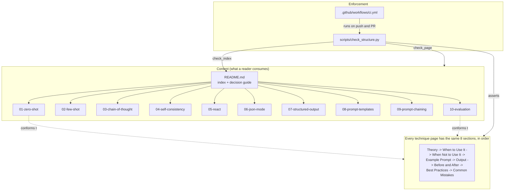

# Prompt Engineering Handbook

A working reference for ten prompt engineering techniques, written as a handbook rather than as a
library. This repository exists because most prompt engineering advice is either a one-line tip with
no context or a research paper with no practical guidance, and neither helps when you are staring at
a prompt that returns the wrong thing. Every technique here gets the same eight-section treatment:
what it is, when to reach for it, when it is the wrong tool, a worked example with its output, a
before-and-after showing a weak prompt repaired into a good one, and the mistakes that bite in
practice. It is deliberately not an application. There is no SDK to install and no API key to set,
because the content is the product. The only executable code in the repository is the CI script that
keeps the ten pages structurally consistent with each other.

## What you'll learn

- **The full technique ladder**, from zero-shot up through agentic tool loops, and the specific
  signal that tells you to climb from one rung to the next.
- **Negative space.** Every page has a "When Not to Use It" section, because knowing that
  self-consistency is useless on open-ended generation is worth more than knowing how it works.
- **The syntax vs shape distinction**: why JSON mode guarantees your response parses while structured
  output guarantees it matches your contract, and why conflating them causes production bugs.
- **Prompt injection as a design concern**, covered concretely in the templates and ReAct pages
  rather than as a footnote.
- **Failure-mode diagnosis.** Each before-and-after names what actually goes wrong with the weak
  prompt, so the fix is legible rather than magic.
- **Evaluation as engineering discipline**: held-out sets, deterministic checks before LLM judges,
  rubric anchoring, and judge calibration.
- **How documentation is kept honest by CI.** The structure check in this repo is a small, readable
  example of testing prose the way you test code.

## Architecture

There is no runtime. The "architecture" is the document structure and the check that enforces it.



Data flow in one sentence: `ci.yml` runs `scripts/check_structure.py`, which reads every
`NN-technique/README.md` plus the top-level `README.md` from disk, collects a list of failures, and
exits non-zero if the list is non-empty.

## Tech stack

| Component | Technology | Why this choice |
|-----------|-----------|-----------------|
| Handbook content | GitHub-Flavored Markdown | Renders natively on GitHub with no build step, diffs cleanly in review, and stays readable in a terminal. The content is the product, so the format should add zero friction. |
| Architecture diagram | Mermaid | GitHub renders Mermaid inline, so the diagram lives in the same file it documents and cannot drift into a stale exported PNG. |
| Structure check | Python 3.12 standard library (`re`, `sys`, `pathlib`) | The only script in the repo. Zero third-party dependencies means CI needs no `pip install` step and the script cannot break from a dependency bump. `pathlib` for filesystem walking, `re` for heading extraction. |
| CI runner | GitHub Actions (`actions/checkout@v4`, `actions/setup-python@v5`) | Already where the repo lives. Two official actions, no self-hosted infrastructure. |
| License | MIT | Permissive, standard for a public reference repo. |

Everything in that table is genuinely used. There is no `requirements.txt`, no `package.json`, and
no lockfile, because nothing is imported that does not ship with Python.

## Folder structure

```text
prompt-engineering/
├── 01-zero-shot/
│   └── README.md              # Instruction-only prompting, and how to constrain output without examples
├── 02-few-shot/
│   └── README.md              # In-context learning via demonstrations; example consistency and bias
├── 03-chain-of-thought/
│   └── README.md              # Eliciting intermediate reasoning; separating the trace from the answer
├── 04-self-consistency/
│   └── README.md              # Sample N reasoning paths at temperature, normalize, take the mode
├── 05-react/
│   └── README.md              # Thought / Action / Observation tool loops and agent safety rails
├── 06-json-mode/
│   └── README.md              # Provider-enforced valid JSON syntax, and why syntax is not shape
├── 07-structured-output/
│   └── README.md              # Schema-bound responses via JSON Schema or Pydantic; enums and strictness
├── 08-prompt-templates/
│   └── README.md              # Parameterized reusable prompts, safe interpolation, injection defence
├── 09-prompt-chaining/
│   └── README.md              # Fixed multi-step pipelines with validation gates between steps
├── 10-evaluation/
│   └── README.md              # Test sets, deterministic scoring, LLM-as-judge rubrics, calibration
├── scripts/
│   └── check_structure.py     # The repo's entire test suite: validates all 11 Markdown files
├── .github/
│   └── workflows/
│       └── ci.yml             # Runs the structure check on push and pull request to main
├── README.md                  # This file: index, decision guide, and repo documentation
├── LICENSE                    # MIT
└── .gitignore                 # OS, Python, Node and editor noise
```

## Codebase walkthrough

The repository has exactly one source file and eleven content files. This section covers both.

### `scripts/check_structure.py`

This is the whole executable surface of the repo, and it is the file worth reading. Its job is to
make an eleven-file documentation set behave like a tested codebase: rather than trusting that every
technique page still has every section, it asserts it on every push.

**Module-level configuration.** A handful of constants define the contract the rest of the file
enforces:

- `ROOT = Path(__file__).resolve().parent.parent` resolves the repo root from the script's own
  location, so the check runs identically from the repo root, from inside `scripts/`, or from an
  absolute path in CI.
- `FOLDERS` is the ordered list of the ten technique directory names. It is the single source of
  truth for what "the handbook" contains.
- `REQUIRED_SECTIONS` is the ordered list of the eight `##` headings every technique page must carry.
  It is ordered on purpose, because the order is itself enforced.
- `FORBIDDEN` holds scaffold markers (`TODO`, `NotImplementedError`, `_Placeholder`,
  `Skeleton page`). If any appears in a page, that page was never finished, and CI says so.
- `EM_DASH` and `MIN_PAGE_CHARS` back the house-style and substance checks respectively.

**`heading_sequence(text) -> list[str]`** is the one parsing primitive. It runs
`re.findall(r"^##\s+(.+)$", text, flags=re.MULTILINE)` and returns the level-2 headings in document
order. Returning a list rather than a set is what makes the ordering check possible; the caller
builds its own set when it only needs membership.

**`check_page(folder) -> list[str]`** validates one technique page and is where most of the logic
lives. It returns a list of error strings rather than raising or printing, so a single run reports
every problem in the repo at once instead of failing on the first one, which matters when you are
fixing things in bulk. In sequence it:

1. Returns early with a single error if `<folder>/README.md` does not exist, since every subsequent
   check would be noise.
2. Reads the file and calls `heading_sequence`, keeping both the ordered list and a set.
3. Appends one error per missing entry in `REQUIRED_SECTIONS`.
4. **Only if nothing is missing**, filters the page's headings down to the required ones and compares
   that list to `REQUIRED_SECTIONS` for exact order. The guard is deliberate: a missing heading would
   otherwise also fail the order comparison and report the same root cause twice.
5. Appends an error for each `FORBIDDEN` marker found in the raw text.
6. Flags any em dash, enforcing the handbook's punctuation style mechanically rather than by review.
7. Requires the substring `"../README.md)"`, which is the relative link back to the index, so no
   technique page can become a dead end.
8. Flags pages shorter than `MIN_PAGE_CHARS` (4000). Eight substantive sections cannot fit in less
   than that, so a short page means a section was gutted.

**`check_index() -> list[str]`** validates the top-level README instead of a technique page. It
confirms the file exists, then asserts that the literal substring `f"{folder}/README.md)"` appears
for all ten folders. That trailing `)` is doing real work: it only matches inside a Markdown link
target, so a bare mention of a folder name in prose does not satisfy the check. It also applies the
same em dash rule to this file and verifies `LICENSE` exists, because this README promises MIT and
that promise should not be able to rot.

**`check_no_stray_folders() -> list[str]`** closes the opposite gap. Every other check iterates over
`FOLDERS`, so a new technique directory added on disk but never registered in `FOLDERS` would be
invisible to all of them. This function walks `ROOT`, matches directory names against
`re.fullmatch(r"\d{2}-[a-z0-9-]+", name)`, and errors on any match not present in `FOLDERS`.

**`main() -> int`** is the composition root and shows the data flow plainly: it accumulates
`all_errors` from `check_page` for each of the ten folders, then `check_index`, then
`check_no_stray_folders`. If the list is non-empty it prints every error as a bullet plus a count and
returns `1`; otherwise it prints a summary naming what was verified and returns `0`. The
`sys.exit(main())` guard at the bottom turns that return value into the process exit code, which is
the entire interface between this script and GitHub Actions.

### `.github/workflows/ci.yml`

A single job named `structure`, triggered on `push` and `pull_request` against `main`. Three steps:
`actions/checkout@v4`, then `actions/setup-python@v5` pinned to Python 3.12, then
`python scripts/check_structure.py`. There is no dependency installation step because the script
imports only from the standard library. The job fails when the script exits non-zero, which is the
mechanism by which a malformed page blocks a merge.

### The ten technique pages

Every `NN-technique/README.md` is a self-contained reference with an identical section skeleton.
Reading them in numeric order is a progression from simplest to most involved, and the pages
cross-link along that progression: `01-zero-shot` points forward to few-shot and chain-of-thought
when its own limits are reached, `06-json-mode` points to `07-structured-output` for the guarantees
it cannot provide, and `09-prompt-chaining` contrasts itself with `05-react` on the fixed-pipeline
versus dynamic-loop axis. The eight sections are:

| Section | What it contains |
|---------|------------------|
| `## Theory` | Two or three paragraphs on the mechanism and why it works. |
| `## When to Use It` | Bulleted triggers: the concrete signals that make this the right technique. |
| `## When Not to Use It` | Bulleted counter-indications, each naming the technique to use instead. |
| `## Example Prompt` | A complete, copy-pasteable prompt in a fenced block. |
| `## Output` | The response, followed by a note on what the model did and why. |
| `## Before and After` | A weak prompt, a diagnosis of what goes wrong, the repaired prompt, and why the repair works. |
| `## Best Practices` | Six actionable rules. |
| `## Common Mistakes` | Six failure modes drawn from the preceding sections. |

Pages that benefit from it also carry short Python snippets in the before-and-after section
(`04-self-consistency` shows vote normalization, `07-structured-output` shows a Pydantic model with
an enum, `08-prompt-templates` shows safe `string.Template` rendering, `09-prompt-chaining` shows
validation gates between steps). These are illustrative fragments, not runnable programs, and the
repo does not execute them.

## Installation

There is nothing to install. Python 3.12 or newer is needed only if you want to run the structure
check locally; reading the handbook needs no toolchain at all.

```bash
git clone https://github.com/ranjan-del/prompt-engineering.git
cd prompt-engineering
```

Then open any technique page, for example:

```bash
less 03-chain-of-thought/README.md
```

To run the check (optional, and requires no virtualenv since there are no dependencies):

```bash
python3 scripts/check_structure.py
```

## Usage

### Reading the handbook

Start at the index table below, or read `01` through `10` in order for the full progression.

| # | Technique | Folder | Use it when |
|---|-----------|--------|-------------|
| 01 | Zero-Shot | [01-zero-shot](./01-zero-shot/README.md) | The task is common and you can describe the output in words |
| 02 | Few-Shot | [02-few-shot](./02-few-shot/README.md) | The format or boundary is easier to show than to describe |
| 03 | Chain-of-Thought | [03-chain-of-thought](./03-chain-of-thought/README.md) | The task genuinely decomposes into dependent steps |
| 04 | Self-Consistency | [04-self-consistency](./04-self-consistency/README.md) | The answer is a single countable value and correctness beats cost |
| 05 | ReAct | [05-react](./05-react/README.md) | The model needs real tools and the step sequence is not known upfront |
| 06 | JSON Mode | [06-json-mode](./06-json-mode/README.md) | Code parses the response and the shape is simple and flat |
| 07 | Structured Output | [07-structured-output](./07-structured-output/README.md) | Downstream code depends on exact keys, types and enums |
| 08 | Prompt Templates | [08-prompt-templates](./08-prompt-templates/README.md) | The same prompt runs over many inputs |
| 09 | Prompt Chaining | [09-prompt-chaining](./09-prompt-chaining/README.md) | One prompt is doing three jobs and all three are suffering |
| 10 | Evaluation | [10-evaluation](./10-evaluation/README.md) | Always, once a prompt is in production |

### Running the structure check

This is the only command the repository exposes. Real output from this machine:

```console
$ python3 scripts/check_structure.py
Structure check passed: 10 technique pages, 8 required sections each (present and in order), no scaffold markers, no em dashes, index links and LICENSE verified (133 assertions).
$ echo $?
0
```

The failure path is the more useful one to see. Temporarily renaming the `## Output` heading to `## Result` in
`01-zero-shot/README.md` and re-running produces:

```console
$ python3 scripts/check_structure.py
Structure check FAILED:
  - 01-zero-shot/README.md missing section: '## Output'

1 problem(s) found.
$ echo $?
1
```

Note that the ordering check stayed quiet there. That is the deliberate guard in `check_page`: with a
section missing, reporting "sections are out of order" as well would be a second symptom of one
cause. Restoring the heading returns the run to the passing output above.

## API reference

Not applicable. This repository exposes no HTTP API, no service, and no importable package. The only
interface is the command-line exit code of `scripts/check_structure.py`:

| Exit code | Meaning |
|-----------|---------|
| `0` | All ten pages have all eight sections in order, no scaffold markers, no em dashes, index links resolve, LICENSE present. |
| `1` | At least one problem, printed as a bulleted list to stdout with a total count. |

## Testing

The repository has no unit test suite by design, because it contains no application logic to test.
What it does have is a structural test over the content, which is the thing that can actually
regress here. Run it with:

```bash
python3 scripts/check_structure.py
```

Observed result on Python 3.14.6 (macOS), all checks green:

```text
Structure check passed: 10 technique pages, 8 required sections each (present and in order), no scaffold markers, no em dashes, index links and LICENSE verified (133 assertions).
```

Exit code `0`. That covers 10 pages against 8 required headings each, plus per-page order, scaffold
marker, em dash, backlink and minimum-length checks, plus ten index link assertions and the
existence checks for `README.md` and `LICENSE`. CI pins Python 3.12; the script uses only standard
library APIs available in both.

## Design decisions and trade-offs

- **An identical eight-section skeleton on every page.** The rigidity is the point: you can jump to
  "When Not to Use It" on any page without reading anything else. The cost is that a section is
  occasionally thinner than it would be if the page were free-form, and the format would not suit a
  technique that does not fit the mould.
- **"When Not to Use It" given equal weight to "When to Use It".** Most prompt engineering material
  is a list of things that work, which is how people end up putting chain-of-thought on a
  translation task. The counter-indications are where the judgement lives.
- **Illustrative outputs, not captured transcripts.** Each `## Output` is labelled as representative
  of a modern instruction-tuned model rather than pasted from a specific API call. The honest
  trade-off: the outputs are pedagogically clean and stable, but they are not reproducible
  benchmarks, and a real model on a real day may answer differently. Labelling them was preferred
  over pretending to a rigour the repo does not have.
- **A CI check on prose.** Documentation repos rot silently. Making the structure machine-checkable
  means a half-finished eleventh technique cannot merge. The trade-off is that the check enforces
  form, never quality: a page of eight well-named headings full of nonsense passes cleanly.
- **Zero dependencies.** No `requirements.txt`, no framework, no static site generator. CI needs no
  install step and cannot break from a dependency bump. The cost is no rendered site, no search, and
  no cross-reference validation beyond simple substring matching.
- **Substring matching instead of a Markdown parser** in `check_index`. Checking for
  `"01-zero-shot/README.md)"` including the closing paren is crude but has no dependencies and no
  false positives on prose mentions. A real parser would catch more, at the cost of the zero-dependency
  property that makes the CI job three steps long.
- **Numbered folders.** `01-` through `10-` encode reading order in the filesystem so directory
  listings sort correctly. Renumbering would be painful, but the ten techniques are stable enough
  that this is unlikely to matter.

## Limitations and future improvements

This is a personal reference handbook, not a production system, and it should not be treated as
authoritative or exhaustive.

Current limitations:

- **Outputs are illustrative, not captured.** Nothing here is a reproducible benchmark. No claim in
  the handbook has been validated against a live model as part of this repository.
- **No runnable code.** The Python fragments in the before-and-after sections are illustrative and
  are never executed, so nothing prevents one from drifting out of sync with current provider APIs.
- **Provider-agnostic to a fault.** Real API details (exact parameter names, which providers support
  strict schemas, current model behaviour) are deliberately omitted, which keeps the pages durable
  but means you still need vendor documentation to implement anything.
- **The CI check validates form, not correctness.** It cannot tell whether the advice is right, only
  whether the headings are present, ordered, and non-empty.
- **Ten techniques is not the field.** Notable omissions include retrieval-augmented generation,
  tree-of-thought, prompt compression, multi-agent patterns, caching strategy, and fine-tuning as an
  alternative to prompting.
- **Snapshot in time.** Prompting advice tracks model capability. Guidance that is correct for
  current instruction-tuned models will age, and some of it (explicit chain-of-thought, in
  particular) is already becoming redundant on reasoning models.

Planned improvements:

- Add an optional `examples/` directory with genuinely runnable, provider-agnostic snippets per
  technique, plus captured real output with the model and date recorded.
- Add a decision flowchart that routes a task description to a recommended technique.
- Add a glossary page for the recurring terms (in-context learning, decoding constraint, temperature,
  LLM-as-judge, strict mode).
- Extend the structure check to validate that intra-handbook relative links resolve to files that
  exist, rather than only checking the index links.
- Add pages for retrieval-augmented generation and tree-of-thought.

## License

Released under the [MIT License](./LICENSE).
