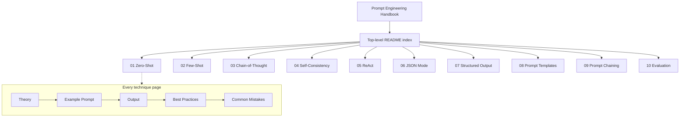

# Prompt Engineering Handbook

A personal, self-contained reference handbook for prompt engineering techniques. This is **not an application** — it is a documentation repository. Each technique lives in its own numbered folder with a consistent structure: theory, an example prompt, its output, best practices, and common mistakes.

> Scaffold status: skeleton only. Each page contains placeholder sections marked with `TODO` comments referencing the handbook checklist.

## Architecture Diagram



## Folder Structure

```text
prompt-engineering/
├── 01-zero-shot/          # Zero-shot prompting
│   └── README.md
├── 02-few-shot/           # Few-shot prompting
│   └── README.md
├── 03-chain-of-thought/   # Step-by-step reasoning
│   └── README.md
├── 04-self-consistency/   # Sample-and-vote reasoning
│   └── README.md
├── 05-react/              # Reason + Act tool loops
│   └── README.md
├── 06-json-mode/          # Valid-JSON output
│   └── README.md
├── 07-structured-output/  # Schema-constrained output
│   └── README.md
├── 08-prompt-templates/   # Reusable parameterized prompts
│   └── README.md
├── 09-prompt-chaining/    # Multi-step prompt pipelines
│   └── README.md
├── 10-evaluation/         # Measuring output quality
│   └── README.md
├── README.md              # This index
├── LICENSE                # MIT
└── .gitignore
```

## Installation Guide

No installation or build is required — this is a documentation repository. Clone it and read.

```bash
git clone https://github.com/ranjan-del/prompt-engineering.git
cd prompt-engineering
```

There is no `docker compose` step: the handbook is not a runnable application.

## Features / Contents

Ten techniques, each documented in its own folder with an identical five-section layout.

| # | Technique | Folder | One-line |
|---|-----------|--------|----------|
| 01 | Zero-Shot | [01-zero-shot](./01-zero-shot/README.md) | Instruction-only, no examples |
| 02 | Few-Shot | [02-few-shot](./02-few-shot/README.md) | Steer with a few demonstrations |
| 03 | Chain-of-Thought | [03-chain-of-thought](./03-chain-of-thought/README.md) | Reason step by step |
| 04 | Self-Consistency | [04-self-consistency](./04-self-consistency/README.md) | Sample many paths, vote |
| 05 | ReAct | [05-react](./05-react/README.md) | Interleave reasoning and tool actions |
| 06 | JSON Mode | [06-json-mode](./06-json-mode/README.md) | Emit valid JSON |
| 07 | Structured Output | [07-structured-output](./07-structured-output/README.md) | Bind output to a schema |
| 08 | Prompt Templates | [08-prompt-templates](./08-prompt-templates/README.md) | Reusable parameterized prompts |
| 09 | Prompt Chaining | [09-prompt-chaining](./09-prompt-chaining/README.md) | Multi-step prompt pipelines |
| 10 | Evaluation | [10-evaluation](./10-evaluation/README.md) | Measure output quality |

## Screenshots

_Coming soon_

## Demo GIF

_Coming soon_

## API Documentation

Not applicable — this repository is a handbook, not a service. _Coming soon_ if runnable snippets are added later.

## Future Improvements

- Fill in each technique page with full theory, example prompts, and outputs.
- Add optional provider-agnostic runnable snippets per technique, noting the model used.
- Cross-link related techniques (e.g. chain-of-thought and self-consistency).
- Add a glossary and a quick-decision guide for choosing a technique.

## License

Released under the [MIT License](./LICENSE). Copyright (c) 2026 ranjan-del.
